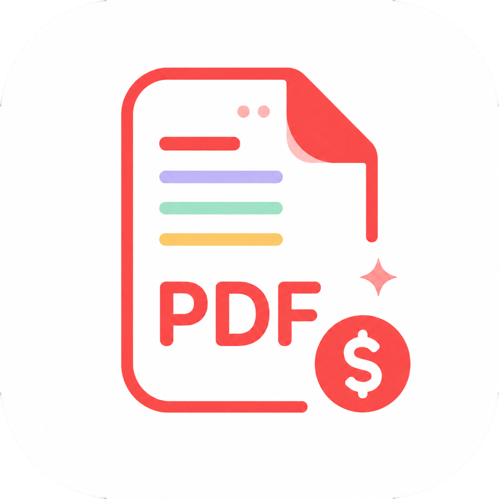

  

<h1 align="center">
Quantaflow
</h1>

Business Quotation Workflow Application

Generate professional quotations, export PDF and Excel (XLSX), print via AirPrint, and share documents directly from your iPhone.

---

# 📱 Overview

Quantaflow is a native iOS application designed to streamline business quotation workflows.

The application enables users to create quotations, generate PDF documents, export Microsoft Excel (XLSX) files, print via AirPrint, and share documents directly from their devices.

Built with SwiftUI, Quantaflow focuses on clean UI/UX, maintainable architecture, multilingual accessibility, and practical business productivity.

---

# ✨ Features

- 📄 Create professional quotations
- 📑 Generate PDF documents
- 📊 Export Microsoft Excel (XLSX)
- 🖨 AirPrint support
- 📤 Share documents
- 📱 Native iOS interface
- 🌙 Dark Mode support
- 🌍 Multi-language user interface
  - 🇺🇸 English
  - 🇯🇵 日本語 (Japanese)
  - 🇹🇼 Traditional Chinese (繁體中文)

---

# 🛠 Tech Stack

### Language

- Swift

### Framework

- SwiftUI
- UIKit
- PDFKit

### Document

- PDF Generation
- Microsoft Excel (XLSX) Export

### Printing

- AirPrint

### Development

- Xcode
- Git
- GitHub

---

# 📷 Screenshots

Coming Soon...

---

# 🏗 Architecture

Coming Soon...

---

# 🚀 Future Improvements

- iCloud Sync
- User Authentication
- Template Management
- PDF Template Customization
- Cloud Backup
- Business Analytics Dashboard

---

# 👨‍💻 Developer

**Bian Yi Syuan**

Mobile & Web Application Developer

🇹🇼 Taiwan
