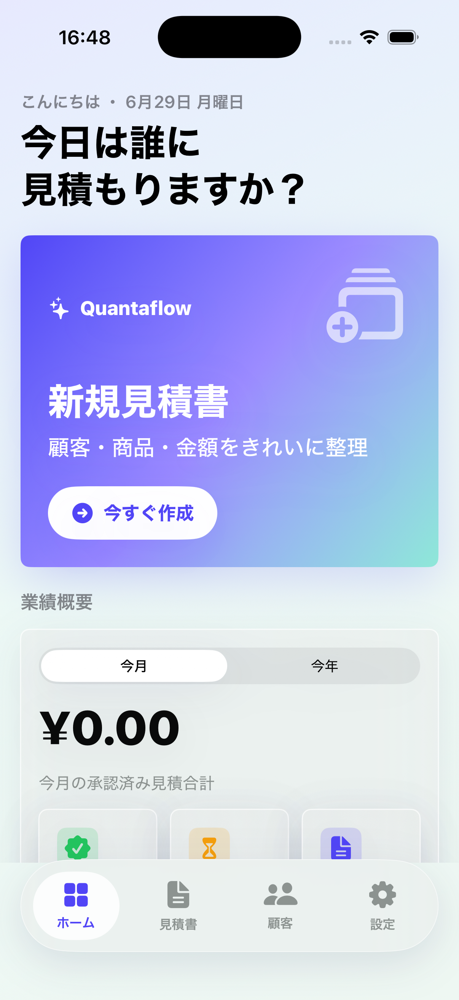
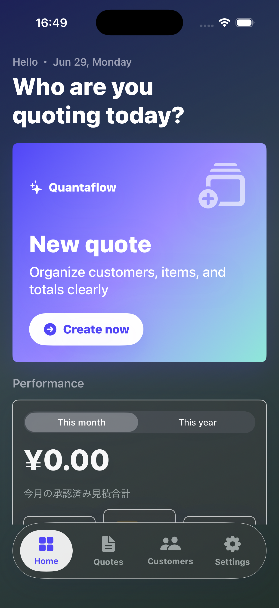
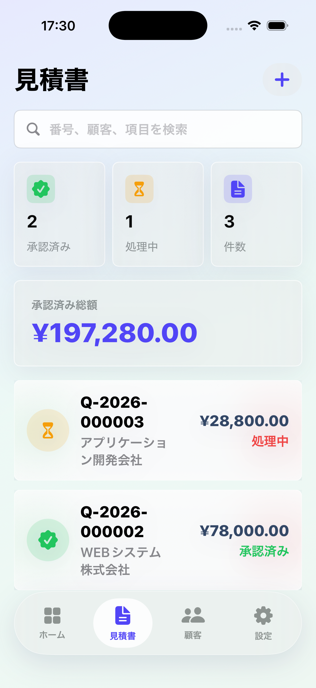
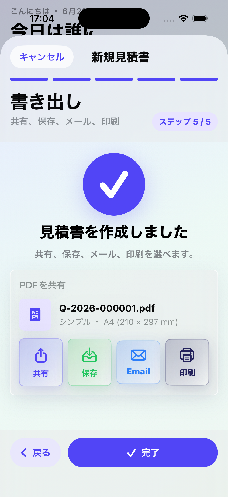
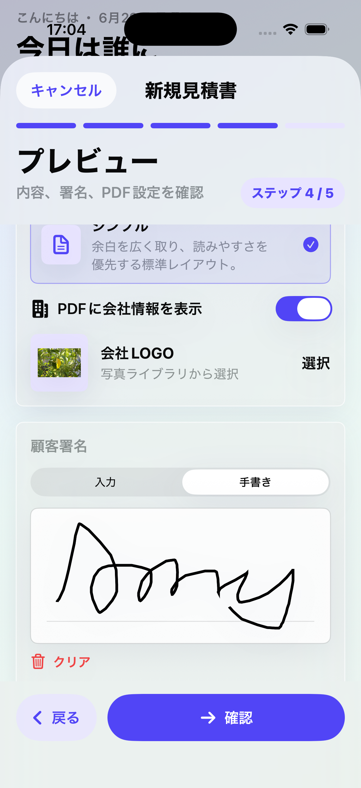
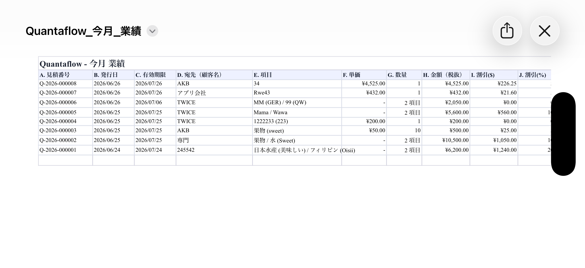

<p align="center">
  
</p>
<h1 align="center">
Quantaflow
</h1>
<p align="center">
Business Quotation Workflow Application
</p>
<p align="center">
Generate professional quotations, export PDF and Excel (XLSX), print via AirPrint, and share documents directly from your iPhone.
</p>
<p align="center">
  
</p>

⸻
# 🎬 Demo

## Main Navigation

<p align="center">
  
</p>

## Quotation Workflow

<p align="center">
  
</p>

⸻

📱 Overview

Quantaflow is a native iOS application designed to streamline business quotation workflows.

The application enables users to create quotations, manage customers and items, generate PDF documents, export Microsoft Excel (XLSX) reports, print via AirPrint, and share documents directly from their devices.

Built with SwiftUI, Quantaflow focuses on clean UI/UX, maintainable architecture, multilingual accessibility, and practical business productivity.

⸻

✨ Features

* 📄 Create professional business quotations
* 📑 Generate polished PDF documents
* 📊 Export Microsoft Excel (XLSX) reports
* 🖊 Add digital signatures to quotations
* 🖨 Print documents via AirPrint
* 📤 Share PDF and Excel files directly from iPhone
* 📈 Track quotation status and monthly performance
* ⚙️ Customize company information, currency, and quotation settings
* 📱 Native iOS interface built with SwiftUI
* 🌙 Light Mode and Dark Mode support
* 🌍 Multi-language user interface
    * 🇯🇵 日本語
    * 🇺🇸 English
    * 🇹🇼 繁體中文

⸻

📷 Screenshots

Main interface

<p align="center">
  
  
  
</p>

Quotation creation and PDF export

<p align="center">
  
  
  
</p>

Excel report

<p align="center">
  
</p>

⸻

🛠 Tech Stack

Language

* Swift

Frameworks

* SwiftUI
* UIKit
* PDFKit

Document Generation

* PDF Generation
* Microsoft Excel (XLSX) Export
* File Sharing
* AirPrint

Development Tools

* Xcode
* Git
* GitHub

⸻

🏗 Architecture

Quantaflow is structured with a clear separation of UI, data models, services, and document generation logic.
```
Quantaflow
├── Models
│   ├── Quotation
│   ├── Customer
│   ├── Item
│   └── CompanyProfile
│
├── Views
│   ├── Home
│   ├── Quotations
│   ├── Customers
│   ├── Settings
│   └── Export
│
├── Services
│   ├── PDFGenerator
│   ├── ExcelExporter
│   ├── PrintService
│   └── ShareService
│
└── Resources
    ├── Localization
    └── Assets
```
The project is designed to keep the codebase maintainable, readable, and easy to extend with new business features.

⸻

🚀 Future Improvements

* iCloud Sync
* User Authentication
* Cloud Backup
* PDF Template Customization
* Advanced Quotation Templates
* Business Analytics Dashboard
* Customer History Management
* AI-assisted Quotation Suggestions

⸻

👨‍💻 Developer

Bian Yi Syuan

Mobile & Web Application Developer

🇹🇼 Taiwan

⸻

📌 Project Purpose

This project was created as a portfolio application to demonstrate iOS development skills, business workflow design, document generation, multilingual UI implementation, and practical mobile productivity features.

⸻

# ▶️ How to Run

1. Clone this repository.
2. Open `Quantaflow.xcodeproj` in Xcode.
3. Select an iPhone simulator.
4. Build and run the project.
